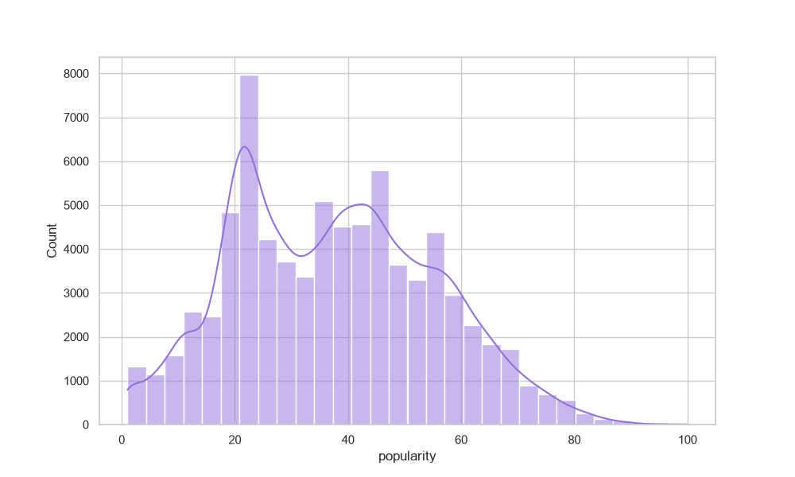
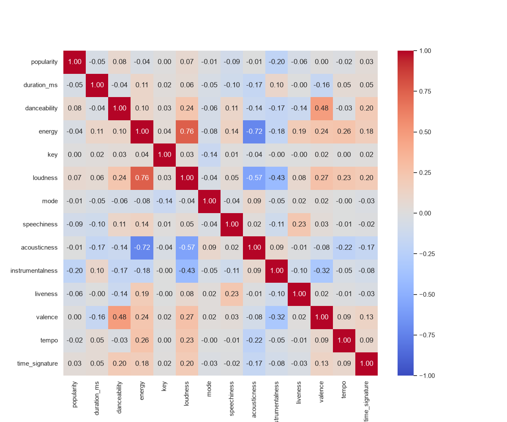
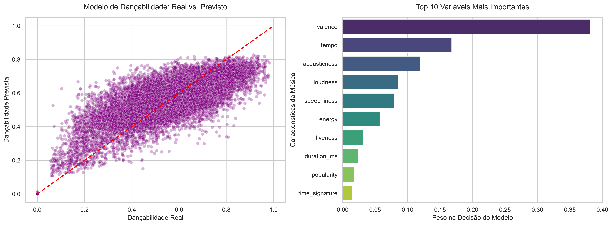

# 🎵 Spotify DataView: Análise Preditiva de Popularidade vs. Dançabilidade

## 📌 Sobre o Projeto

Este é um projeto completo de Ciência de Dados que explora o dataset de faixas musicais do Spotify. A arquitetura foi desenvolvida utilizando boas práticas de engenharia de software para projetos de dados, separando a lógica de negócio em scripts modulares (`src/`) e a exploração visual em Jupyter Notebooks.

O grande diferencial deste projeto está no seu **Roteiro Analítico**, que compara duas abordagens preditivas distintas utilizando o algoritmo **Random Forest Regressor**: uma focada no sucesso comercial (fatores mercadológicos/externos) e outra focada na estrutura da música (fatores musicais/intrínsecos).

---

## 🧠 O Roteiro Analítico & Descobertas (Storytelling)

O projeto provou que a eficácia de um modelo de Machine Learning depende drasticamente da natureza do alvo (`target`) escolhido, revelando insights profundos sobre o mercado da música:

### 📊 Abordagem 1: Previsão de Popularidade (Fatores Externos)

- **O Alvo:** `popularity` (escala de 0 a 100).
- **Métricas Obtidas:** R² de **17.46%** | MAE de **~13.0 pontos**.
- **O Insight de Negócio:** Inicialmente, o modelo parecia pontuar melhor devido ao ruído de uma "montanha" artificial de músicas com popularidade zero. Após uma limpeza rigorosa desses dados, o R² real caiu para 17.4%. Isso provou matematicamente que **atributos sonoros isolados não explicam o sucesso de uma música**. A popularidade no Spotify é fortemente influenciada por fatores externos, como marketing, peso da gravadora e viralização em redes sociais (TikTok).

#### 📈 Visualizações da Análise Inicial (Popularidade)

Durante a fase exploratória, geramos gráficos que justificaram a limpeza dos dados e comprovaram a falta de correlação matemática da popularidade com o áudio:

**1. A "Montanha" de Popularidade Zero:** O gráfico de distribuição original revelou uma anomalia severa de músicas inativas/ruído no valor `0`. Isso motivou a nossa função de limpeza a remover esses dados para não enviesar o modelo.



**2. Mapa de Correlação (Heatmap):** A matriz provou visualmente que a variável `popularity` possui correlações extremamente fracas (próximas de 0) com todas as características sonoras. Isso justificou o teto baixo de aprendizado (17%) do primeiro modelo.



---

### 🕺 Abordagem 2: Previsão de Dançabilidade (Fatores Musicais) - O Pivô do Projeto

- **O Alvo:** `danceability` (escala de 0.0 a 1.0).
- **Métricas Obtidas:** R² de **56.03%** | MAE de **0.09 pontos** (um erro menor que 10%).
- **O Insight de Negócio & Conclusão Visual:** Ao mudar o foco para uma métrica puramente musical, o desempenho do modelo foi **mais do que triplicado**. Através da análise de importância das variáveis (_Feature Importance_), descobrimos que:
  1. **A `valence` (valência) é a variável mais importante isolada:** O modelo identificou que músicas com maior positividade e ambiente eufórico/feliz são as que mais convidam à dança.
  2. **O Ritmo importa:** O `tempo` (BPM) e a baixa presença de elementos acústicos (`acousticness`) são os próximos fatores críticos na decisão do modelo.
  3. **A Popularidade é irrelevante para a dança:** O gráfico revelou que a popularidade ficou no fim da fila de importância, provando que uma música ser famosa não dita o quão dançante ela é.

#### 📊 Gráficos de Validação do Modelo de Dançabilidade

Abaixo está a validação visual do comportamento do modelo, mostrando a relação entre os valores reais e as previsões (esquerda) junto ao peso de cada característica musical na tomada de decisão (direita):



---

## 🛠️ Pipeline de Tratamento de Dados (Data Cleaning)

A análise estatística inicial (`.describe()`) revelou distorções severas nos dados brutos. Para garantir a saúde dos modelos, a função `clean_data` (em `src/features.py`) aplicou um pipeline rigoroso que reduziu a base de **114.000 para 75.852 linhas de alta qualidade**:

1. **Remoção de Índices Órfãos:** Eliminação das colunas redundantes `Unnamed: 0` e `Unnamed: 0.1`.
2. **Ordenação e Filtragem de Duplicados:** Músicas repetidas foram removidas, mantendo apenas a versão com maior relevância.
3. **Tratamento de Outliers de Tempo:** A análise descritiva revelou discrepâncias severas na cauda direita da distribuição de duração das músicas. Com o objetivo de normalizar os dados para as etapas de modelagem, aplicou-se um filtro de corte baseado no percentil 99 (quantile(0.99)), restringindo o escopo do estudo a faixas com duração máxima de até 9 minutos.
4. **Filtro de Ruído Comercial:** Exclusão de faixas com popularidade estritamente igual a zero (músicas inativas ou erros de catálogo), elevando o valor mínimo de popularidade para `1.00`.

---

## 📂 Estrutura do Repositório

```text
📁 spotify_dataview/
├── 📁 data/           # Arquivos de dados (ignorados no Git por tamanho)
│   ├── raw/           # Dataset original (spotify-tracks-dataset.csv)
│   └── processed/     # Dados limpos e preparados pós-pipeline
├── 📁 notebooks/      # Jupyter Notebooks para desenvolvimento e visualizações
│   └── spotify_dataview.ipynb
├── 📁 outputs/        # Imagens e modelos exportados
│   └── figures/       # Gráficos e visualizações geradas
├── 📁 src/            # Scripts Python contendo os módulos do pipeline
│   ├── modeling/
│   │   └── train.py   # Funções de treinamento e avaliação de modelos
│   ├── config.py      # Definição de caminhos globais e constantes
│   ├── dataset.py     # Funções de IO (carregamento e salvamento de dados)
│   ├── features.py    # Pipeline de limpeza avançada e engenharia de features
│   └── plots.py       # Funções de geração de gráficos padronizados
├── .gitignore         # Lista de arquivos e caches omitidos do controle de versão
└── README.md          # Documentação principal do projeto

🚀 Como Executar o Projeto
1. Clonar o Repositório
Bash
git clone [https://github.com/enrizes-lab/ProjetoFinal_modulo1](https://github.com/enrizes-lab/ProjetoFinal_modulo1)
cd spotify_dataview
2. Adicionar o Dataset
Por motivos de boas práticas, os arquivos de dados estão sob regras do .gitignore. Baixe o dataset do Spotify (https://www.kaggle.com/datasets/maharshipandya/-spotify-tracks-dataset?select=dataset.csv) e armazene-o em:
data/raw/spotify-tracks-dataset.csv
3. Executar o Pipeline
Abra o VS Code ou o seu ambiente Jupyter e execute o ficheiro:
notebooks/spotify_dataview.ipynb
```
